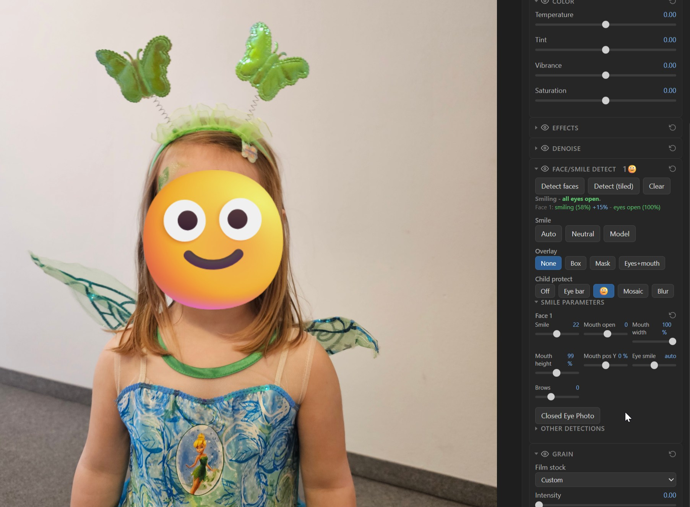

# RAW Viewer

Open a RAW photo in your browser. Edit it. Save a JPEG.

Nothing gets uploaded. No install, no account, no subscription. One HTML file, one browser tab.


| Grain, LUTs, denoise | A/B split compare |
|---|---|
|  |  |

## Start

Open <https://lda.io/raw-viewer> and load a photo.

To run it locally, clone the repo and start the server:

```
serve.cmd            # or: python serve.py [port]   (Python 3)
```

Then open <http://localhost:8791/>.

Double-clicking `index.html` also works, but you get the 2016 decoder and no face tools. Use the server.

## What it does

- **Opens your files.** RAW from 1000+ cameras, plus JPEG, PNG, WebP, HEIC, TIFF, BMP, GIF.
- **Grades live on the GPU.** Exposure, contrast, highlights, shadows, white balance, saturation, vibrance, sharpness, denoise.
- **Takes two LUTs.** One for the conversion, one for the look. Own intensity each. Any `.cube` file.
- **Adds film grain.** Pick Super 8, 16mm, 35mm or 65mm. Scales with resolution, so 12MP and 60MP match.
- **Stacks layers.** Images, SVGs, text, emoji. Blend modes, tiling, chroma-key, drag to place.
- **Crops and rotates.** Any angle, aspect presets, zoom, pan.
- **Fixes faces.** Smile, closed eyes, child protect. All in the tab. See below.
- **Exports JPEG.** Full resolution, or a size you pick. Histogram and A/B split to check it first.

Double-click any slider to reset it. Pinch to zoom on a phone.

## Faces

Runs locally, bakes into the export, nothing leaves the tab.

- **Detect** - finds every face, tiled scan for the small and tilted ones. Reports smile % and eyes open % per face.
- **Smile** - eight sliders per face, or one button. Auto, Neutral and Model measure, correct, and measure again until the face hits the target.
- **Eyes from photo** - someone blinked. Point that face at a frame where they didn't and it takes both eyes, matched for lid shape, gaze and colour. Set per face, so a group shot can pull from three frames at once.
- **Child protect** - eye bar, emoji, mosaic or blur, cut to the face and aware of head tilt.
- **More MediaPipe** - object boxes, scene labels, hair/skin/clothes segments, click-to-mask cutouts, pose, hands. Export as transparent PNG, or write detected objects into the JPEG's EXIF keywords.



## Price

Free. No login, no paywall, no tracking, nothing held back.

If it saved you time: <https://patrickgawron.com/support/raw-viewer>. Supporters get 9 preset slots instead of 3. That is the whole perk.

Keys verify offline with ECDSA P-256 via `crypto.subtle`. No network call. Issued by the [`supporter-key`](../supporter-key) CLI.

---

# Technical FAQ

<details>
<summary><b>Which RAW files work?</b></summary>

Server or live site: **LibRaw 0.22.1**. 1000+ cameras, including Sony ZV-E1, Canon CR3, newer lossless-compressed ARW, current DNG, GoPro GPR, Phase One IIQ.

From `file://`: **dcraw 9.26** only. ARW, CR2, NEF, DNG, RAF, ORF, RW2, PEF, SRW, SR2, KDC, DCR, MRW, 3FR, ERF, MEF, MOS, X3F and more, but frozen around 2016.

Each file tries LibRaw, then dcraw, then the embedded JPEG preview.
</details>

<details>
<summary><b>Why does it need a server?</b></summary>

LibRaw uses threads, which need shared memory, which needs the page cross-origin isolated: `Cross-Origin-Opener-Policy: same-origin` plus `Cross-Origin-Embedder-Policy: require-corp`. `serve.py` sends those headers. `python -m http.server` does not. On GitHub Pages, `coi-serviceworker.js` does it client-side.

The face tools need a server for a second reason: module workers don't run on `file://`.
</details>

<details>
<summary><b>Is anything uploaded?</b></summary>

No. There is no backend. Decode, grade, detect and export all run in the tab.

The MediaPipe models sit in `face/`, about 72 MB total (face landmarker, pose, hands, segmentation, object detection, classification). Each loads the first time you use its feature.
</details>

<details>
<summary><b>How does the grade pipeline work?</b></summary>

WebGL2 fragment shaders on the decoded image. Sliders are live. Denoise and sharpness run as cached full-resolution passes after them, and the export runs the same passes.

- **Sharpness** - contrast-adaptive unsharp mask on luma, gain reduced near high contrast and clipping, clamped to the local min/max. Luma only, so no colour fringing.
- **Grain** - additive, luma-weighted, band-limited Perlin noise with particle shaping, normalized to resolution, anchored to the image.
- **LUTs** - two `.cube` slots with per-slot intensity.

Grain and sharpness are full-resolution effects. Judge them at 100% zoom.
</details>

<details>
<summary><b>What happens when I move a smile slider?</b></summary>

A piecewise-affine mesh warp. Lip rings are Delaunay-triangulated inside a pinned anchor ring, so nothing outside the mouth moves. Resampling is Catmull-Rom, which keeps the warped area about as sharp as the rest of the face.

Shading a warp can't create is painted: the closed-lip contact line, the nasolabial fold, the crease under the eye. The eye aperture and iris stay pinned, because a mesh can't show a lid sliding over an eyeball.
</details>

<details>
<summary><b>How does the eye transplant work?</b></summary>

A similarity transform fits the donor eye to the target, then a Gaussian RBF field over 16 ring landmarks bends it onto your own lid contour. You keep your eye shape and borrow only the open pixels. Feathered blend in linear light, colour matched per channel.

Gaze is matched, not inherited. An open eye states its own, a shut one copies its partner, and with both shut the donor keeps its placement. Head roll comes off the face's eye-corner baseline.

Size, direction and angle sliders cover what a 2D fit can't. Only fires on an open target eye.
</details>

<details>
<summary><b>Does it work on a phone?</b></summary>

Yes. Photo on top, controls below, pinch to zoom, vertical drags scroll the panel instead of moving sliders. A button switches the photo pane between two thirds and one third of the screen.

A 60MP RAW still takes a moment to decode.
</details>

<details>
<summary><b>What's in the repo?</b></summary>

| File | Purpose |
|---|---|
| `index.html` | the whole app, UI and WebGL2 pipeline |
| `dcraw.js` | dcraw 9.26 asm.js decoder, offline fallback |
| `libheif.js` | HEIC/HEIF decoding |
| `utif.js` | TIFF decoding (UTIF, MIT) |
| `pako_inflate.min.js` | inflate for ZIP-compressed TIFFs (pako, MIT) |
| `libraw/` | LibRaw-Wasm 1.6.0 |
| `face/` | MediaPipe tasks-vision 0.10.35 plus models |
| `coi-serviceworker.js` | cross-origin isolation shim (MIT, G. Zuidhof) |
| `serve.py` / `serve.cmd` | dev server with COOP/COEP headers |

</details>

## Credits

- [LibRaw](https://www.libraw.org/) via [libraw-wasm](https://github.com/ybouane/libraw-wasm) (LibRaw 0.22.1)
- [dcraw](https://www.dechifro.org/dcraw/) 9.26, Dave Coffin, via the `dcraw` npm asm.js build
- [libheif](https://github.com/strukturag/libheif)
- [UTIF.js](https://github.com/photopea/UTIF.js) - MIT, Ivan Kutskir
- [pako](https://github.com/nodeca/pako) - MIT AND Zlib
- [coi-serviceworker](https://github.com/gzuidhof/coi-serviceworker) - MIT, Guido Zuidhof
- [MediaPipe tasks-vision](https://github.com/google-ai-edge/mediapipe) - Apache-2.0, Google
- Film grain approach inspired by [filmgrainer](https://github.com/larspontoppidan/filmgrainer)
