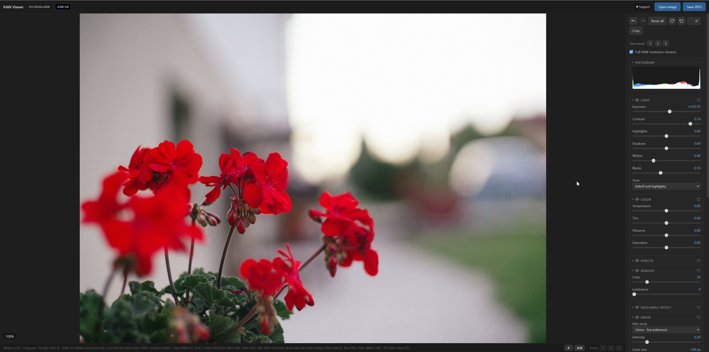
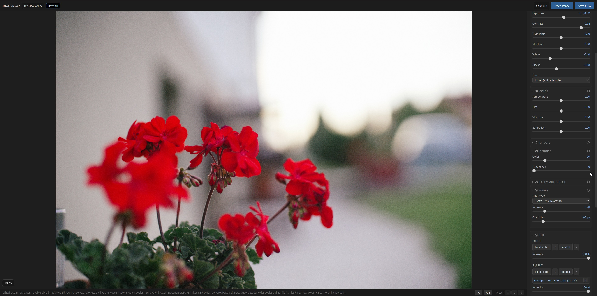
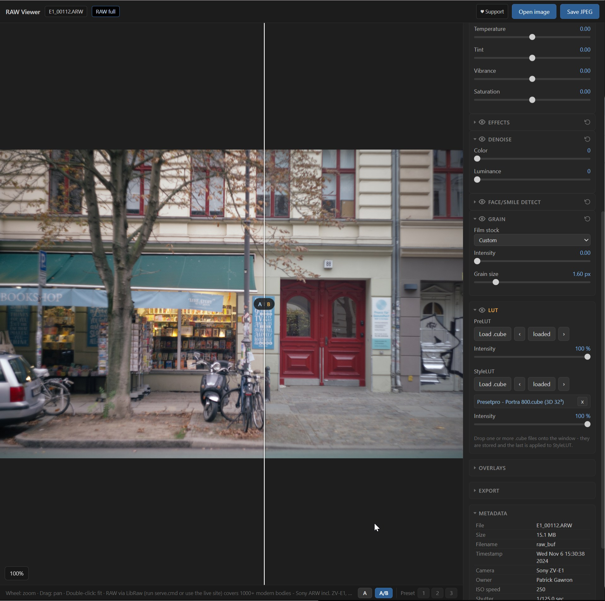

# RAW Viewer

Browser-based RAW photo viewer and editor. Single-page app (`index.html`), vanilla JS, WebGL2 pipeline. No build step, no backend.

By **Patrick Gawron** ([pg0](https://github.com/pg0)) - <https://github.com/pg0/raw-viewer>
Live demo: <https://pg0.github.io/raw-viewer/>



| Grain, LUTs, denoise | A/B split compare |
|---|---|
|  |  |

## Features
- RAW decode (LibRaw + dcraw), plus JPEG / PNG / WebP / BMP / GIF / HEIC / TIFF (uncompressed, LZW, PackBits, ZIP; 8- and 16-bit, via UTIF)
- Real-time WebGL2 adjustments: exposure, contrast, highlights/shadows, white balance, saturation, vibrance, and film grain - additive, luma-weighted, band-limited (Perlin gradient noise + particle shaping, same math as the FilmGrain DCTL), image-anchored so it bakes into the export. Grain controls are minimal and WYSIWYG: pick a film stock (Super 8 / 16mm / 35mm / 65mm / Custom) and it writes the visible Intensity + Grain size sliders to that format's real values (no hidden multiplier); editing a slider by hand flips it to Custom. Grain size is resolution-normalized (scales with image height / 1080p) so the look is identical at any resolution, and it starts off (Custom, intensity 0)
- Two `.cube` LUT slots (converter + style) with per-slot intensity
- Overlays: stack images, SVGs, text, or emoji (grain, film strip, light leaks, dust, stickers, captions) blended over the photo. Add via the panel buttons (+ Image / + Text / + Emoji) or by dropping an image onto the panel. Per overlay: blend mode (Normal / Screen / Multiply / Add), opacity, keep-aspect (contain-fit vs stretch), tiling, scale/zoom (0.1x - 12x), X/Y offset, and an optional alpha (chroma-key) colour to knock a colour out to transparent. Select an overlay and drag it on the photo to reposition it, drag the grip handle in the list to reorder layers, and double-click a text overlay to edit it. An "Apply effects to overlays" toggle at the top of the panel grades the overlays together with the photo (LUT, grain, exposure and the rest land on the overlays too). Overlays track crop/rotation and bake into the export
- Free-angle rotation (type any degree, or 90&deg; CW/CCW icons), crop with aspect presets (Free / 1:1 / 5:4 / 16:9 / 20:9) and a Portrait/Landscape orientation toggle, zoom/pan
- Histogram, per-group show/hide (A/B compare), JPEG export at full resolution - or downscaled via the Export panel: longest side (px), megapixels, or an exact pixel box (fit inside, aspect kept; downscale only, stepped high-quality resampling, the label previews the output size)
- Face/Smile Detect: detection, smile solvers, retouch sliders, child-protect anonymization, closed-eye donor fix, object/scene detections with EXIF keywords - all local, see [Face/Smile detect](#facesmile-detect)
- Double-click (or double-tap on touch) any slider or its label to reset it
- "Full resolution" toggle appears only for RAW files (nothing to re-decode behind a JPEG/PNG)
- Always-visible top bar (title + Open / Save) and a mobile-friendly layout: photo pinned on top, controls scroll below, pinch-to-zoom, vertical drag scrolls the panel (doesn't nudge sliders), and a button to switch the photo pane between 2/3 and 1/3 of the screen

## Face/Smile detect

Local face detection and retouch - MediaPipe FaceLandmarker WASM, vendored in `face/`, lazy-loaded, no cloud. Everything bakes into the export. Needs the server or the live site (the WASM engine can't load from `file://`).

### Detection and status

- Auto-detects when the panel opens or a new photo loads. "Detect (tiled)" re-scans in 4 overlapping 2x tiles for small faces in group shots the full-frame pass misses.
- Low confidence bar (0.15), then junk is dropped by nose-distance dedup and a minimum face size.
- Per face: smile %, eyes open %, and an expression bucket (happy / neutral / surprised / angry / sad). Header shows counts: "2🙂 1😐" (smiling = 30%+).
- Faces an edit changed get a delta marker ("+21%" green for a boost, gray for a deliberate drop); tooltip shows the pre-edit value.
- Live re-analysis while dragging a slider - only the dragged face is re-measured, each face costs a full detector pass.
- Click a face (photo or panel label) to select it; solvers and Child protect then edit only that face. Its × badge or Delete removes a wrong detection.
- Mask overlay per face: None / Box / Mask / Eyes+mouth; outlines track the warp.
- The panel header's eye toggle bypasses the whole face bake - combined with A/B or the split view it compares edited vs. untouched.

### Smile solvers

- **Auto / Neutral / Model** close a feedback loop: set a value, bake, re-measure with MediaPipe, correct - until each face hits the target measured smile (Auto ~55%, Neutral closed with a hint of a smile, Model closed and near flat).
- The mouth close meets in landmark pairs just under the upper lip, with the contact line pulled to the corner-to-corner chord plus a per-button centre dip - flat is the worst allowed outcome, corners never droop.
- Pairs overshoot 5% so no teeth sliver survives; cheeks relax in proportion to how far the mouth was open; a painted contact shadow (sampled from the lip, kept red, width tapering sublinearly) covers what texture filtering leaves. It fades on already-closed mouths and is skipped under a covering Child-protect mode.
- The measurement replays the exact detection tile that found each face - a full-frame re-detect can't see tiled faces. A face the detector loses mid-solve keeps the analytic estimate.

### Smile parameters

Five sliders per face: Smile, Mouth width, Mouth height, Mouth pos Y, Brows (the upper lids follow the raise, so the eyes open with the brows). The warp is piecewise-affine: lip rings Delaunay-triangulated with a pinned anchor ring, zero displacement outside - nothing but the mouth region can move. Smile targets follow real muscle kinematics (corner curvature over width, damped far side on turned heads); negative values relax rather than mirror the smile.

### Child protect

Anonymize faces per person: eye bar (black/white), emoji smiley (double-click on the photo to swap), mosaic, or blur - clipped to the face silhouette, head-roll aware. With a face selected the buttons set only that face, otherwise the default for everyone. Drawn into the bake, so it survives the export; mosaic/blur read the ungraded base, so the grade still applies on top.

### Closed eye photo

Load a second shot of the same people: closed eyes are replaced with the donor's open ones (per-eye similarity transform, feathered blend in linear light, luma matched). Eye size / direction sliders cover what the 2D auto-fit can't (3D gaze mismatch).

### Other detections

- The rest of the MediaPipe suite as overlays, each model loaded on first use: **Objects** (tiled EfficientDet boxes; click to select, double-click to rename), **Scene** (ImageNet labels), **Segments** (hair / skin / face / clothes), **Select** (click any object to mask it; ctrl adds, shift cuts), **Pose**, **Hands**. Confidences run below MediaPipe's defaults on purpose - at the defaults a group shot returns only the largest, most frontal person.
- "to EXIF" writes detected object classes into the exported JPEG as keywords (EXIF XPKeywords = Windows "Tags", plus XMP `dc:subject` for Lightroom/Bridge). Works without any detected face.
- A debug block lists input size, per-pass counts, what the filters dropped, and per-face metrics.

## Two ways to run

### 1. Quick (`file://`) - double-click `index.html`
Works for standard images, `.cube` LUTs, and RAW from cameras the bundled **dcraw 9.26** can decode. For newer RAW it cannot decode, it shows the embedded JPEG preview. LibRaw is unavailable here (service workers / module workers don't run on `file://`).

### 2. Full decoder - run `serve.cmd` (or deploy to Pages)
Starts a local server on `http://localhost:8791/` and enables the **LibRaw 0.22.1** decoder (`libraw/`).

```
serve.cmd            # or: python serve.py [port]   (Python 3)
```

LibRaw is a pthreads WebAssembly build (shared memory), so the page must be **cross-origin isolated** (`Cross-Origin-Opener-Policy: same-origin` + `Cross-Origin-Embedder-Policy: require-corp`). `serve.py` sends those headers - a plain `python -m http.server` will not work. On GitHub Pages (which can't set headers) a bundled `coi-serviceworker.js` shim provides the same isolation client-side.

## Supported RAW formats
The extension list many tools quote is **dcraw 9.26's** set (ARW, CR2, NEF, DNG, RAF, ORF, RW2, PEF, SRW, SR2, KDC, DCR, MRW, 3FR, ERF, MEF, MOS, X3F, ...) - and it's frozen at ~2016, so it misses recent bodies.

With the LibRaw path enabled (server / Pages) support jumps to **LibRaw 0.22.1's** full modern list: 1000+ cameras including **Sony ZV-E1**, Canon **CR3**, newer lossless-compressed ARW, current DNG, GoPro GPR, Phase One IIQ, and more. dcraw remains only as the offline (`file://`) fallback.

### Decoder cascade
For a RAW file the app tries, in order:
1. **LibRaw** (server/Pages) - full decode of virtually any modern RAW.
2. **dcraw** (also `file://`) - older cameras.
3. **Embedded JPEG** - last resort so the file stays viewable / croppable / exportable.

## Supporter key

RAW Viewer is free and stays free - no login, no paywall, no tracking. If it
saves you time, there's an optional "supporter key" honor-system nudge: the
♥ Support chip in the top bar opens a small modal explaining the deal, with
a link to <https://patrickgawron.com/support>.

Unlock works three ways:
- Paste a key into the modal's input and hit Unlock.
- Open the app with `?key=<key>` or `#key=<key>` in the URL (the key is
  saved to `localStorage` and stripped from the URL automatically).
- Nothing to do on repeat visits - a previously unlocked key is remembered.

Once unlocked, the chip becomes "♥ Thanks, `<name>`" (hover for the
supporter-since date), and the settings-preset row in the sidebar grows from
**3 slots to 9** - the app's only supporter perk. Nothing is removed or
gated for non-supporters; the tool stays fully functional either way.

Verification is 100% local: ECDSA P-256 + SHA-256 via the browser's
`crypto.subtle`, no network call, no server. Keys are issued with the
[`supporter-key`](../supporter-key) CLI - see that project for the format
spec, the issuing workflow, and how to embed the same verify snippet in
another tool.

## Files
| File | Purpose |
|---|---|
| `index.html` | the whole app (UI + WebGL2 shader pipeline) |
| `dcraw.js` | dcraw 9.26 asm.js decoder (offline fallback) |
| `libheif.js` | HEIC/HEIF decoding |
| `utif.js` | TIFF/TIF decoding (UTIF, MIT) |
| `pako_inflate.min.js` | inflate for ZIP-compressed TIFFs (pako, MIT) |
| `libraw/` | LibRaw-Wasm 1.6.0 (index.js, worker.js, libraw.js, libraw.wasm) |
| `face/` | MediaPipe tasks-vision 0.10.35 (vision_bundle.mjs, wasm/) plus the models: face_landmarker, pose_landmarker_lite, hand_landmarker, selfie_multiclass_256x256, efficientdet_lite0, efficientnet_lite0, magic_touch (~72 MB total, each loaded only when its feature is used) |
| `coi-serviceworker.js` | cross-origin isolation shim for static hosts (MIT, G. Zuidhof) |
| `serve.py` / `serve.cmd` | dev server with COOP/COEP headers |

## Credits
- [LibRaw](https://www.libraw.org/) via [libraw-wasm](https://github.com/ybouane/libraw-wasm) (LibRaw 0.22.1)
- [dcraw](https://www.dechifro.org/dcraw/) 9.26 (Dave Coffin) via the `dcraw` npm asm.js build
- [libheif](https://github.com/strukturag/libheif)
- [UTIF.js](https://github.com/photopea/UTIF.js) - MIT, Ivan Kutskir (TIFF decoding)
- [pako](https://github.com/nodeca/pako) - MIT AND Zlib (inflate for ZIP-compressed TIFFs)
- [coi-serviceworker](https://github.com/gzuidhof/coi-serviceworker) - MIT, Guido Zuidhof
- [MediaPipe tasks-vision](https://github.com/google-ai-edge/mediapipe) - Apache-2.0, Google (face landmarks + blendshapes for Smile Detect; pose, hand, segmentation, object-detection and image-classification models for the Advanced overlays)
- Film grain approach inspired by [filmgrainer](https://github.com/larspontoppidan/filmgrainer)
